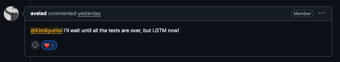
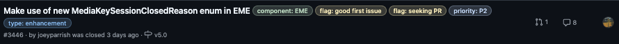

## 새해 첫 주에 좋은 소식이 생겼어요

Google에서 관리하는 오픈소스 미디어 플레이어 [Shaka Player](https://github.com/shaka-project/shaka-player)에 처음으로 PR을 올렸는데, 메인테이너인 [@avelad](https://github.com/avelad)님한테 **LGTM** 을 받았어요! 🎉


<div class="caption">남들의 도움이 아닌 제 스스로 처음으로 오픈소스에 기여해보는 거라 긴장했는데, <br/>메인테이너분과의 적극적인 소통 덕분에 무사히 머지될 수 있었습니다.</div>

과거 취준생 시절 **OSSCA(오픈소스 컨트리뷰션 아카데미)** 활동을 통해 [Yorkie](https://github.com/yorkie-team) 프로젝트에 기여하며 오픈소스의 매력을 처음 알게 되었었는데요. 마침 올해 신년 목표를 '오픈소스 기여하기'로 세웠던 터라, 이번 Shaka Player 기여가 더욱 뜻깊게 다가왔습니다.

이번 글에서는 이슈 선정부터 해결 과정까지의 여정을 공유해볼게요.

## 이슈 선정 배경

최근 회사에서 프로젝트 하나를 담당하게 되었었는데요. 그때 영상 플레이어 개발을 전담하게 되면서 Shaka-player 라이브러리를 적극적으로 활용하고 있습니다. 업무 과정에서 사내 플레이어의 패키징 및 모듈화 작업을 진행하며 미디어 재생 기술을 깊이 있게 다룰 기회가 있었는데요.

이 과정에서 Shaka-player의 내부 구조와 원리에 대해 더 자세히 학습하고 싶다는 욕심이 생겨, 단순한 코드 분석을 넘어 직접 기여까지 도전하게 되었습니다.

기여할 이슈를 찾을 때는 우선적으로 **`good first issue`** 라벨이 붙은 항목들을 살펴보았습니다. 오픈소스 기여가 처음인 만큼, 프로젝트의 컨벤션과 구조를 익히기에 적당한 난이도의 이슈부터 차근차근 시작하고 싶었기 때문입니다. 다행히 Shaka Player 레포지토리에서 2개의 적절한 이슈를 찾았고, 그중 하나를 선택해 본격적인 분석에 들어갔습니다.


<div class="caption">Shaka Player 레포지토리에서 발견한 good first issue</div>

## 이슈 파악과 AI의 도움

이슈를 선정한 뒤에는 본격적으로 문제의 원인을 파악해야 했습니다. 최근에는 여러 AI 모델들이 비약적으로 발전하면서, 어떤 모델을 사용하더라도 복잡한 오픈소스 프로젝트의 맥락을 이해하는 데 큰 도움을 받을 수 있게 되었는데요.

덕분에 예전보다 훨씬 수월하게 오픈소스에 기여할 수 있는 환경이 되었다고 생각합니다. 저 역시 이번 기여 과정에서 **Antigravity**와 **Claude Code**라는 든든한 AI 동료들의 도움을 받았습니다. 특히 수만 줄의 코드 사이에서 특정 로직의 흐름을 짚는 것이 쉽지 않았는데, AI의 **Web Search MCP** 기능과 자체 구글링을 조합해 이슈의 본질을 빠르게 파악할 수 있었습니다.

당시 AI를 통해 이슈를 요약하며 흐름을 잡았던 과정입니다:

### 📋 이슈 #3446 요약

```txt
  제목: Make use of new MediaKeySessionClosedReason enum in EME

  배경:
  - EME (Encrypted Media Extensions) 스펙에 새로운 MediaKeySessionClosedReason enum이 추가됨
  - 이 enum은 MediaKeySession의 closed Promise가 resolve될 때 사용됨

  해결해야 할 문제:
  - 특히 hardware-context-reset 값이 중요: 디바이스가 sleep/wake up될 때 발생
  - 이런 경우 자동으로 새로운 세션을 생성해서 재생을 복구해야 함
  - Windows 노트북에서 L1 콘텐츠 재생 중 sleep 시 테스트 가능

```

## 기술적 배경: EME와 DRM

플레이어 특성상 생소한 용어가 많아 처음에는 문턱이 높게 느껴졌습니다. 특히 DRM(Digital Rights Management) 콘텐츠를 암호화/복호화하는 과정을 제대로 이해해야 수정이 가능했는데요.

> 💡 DRM의 기초 개념은 [Netflix 화면을 캡처하면 왜 검은 화면이 나올까?](/drm/) 글을 참고해 주세요!

제가 DRM을 통해 공부를 하게 되면서 브라우저에서 암호화된 영상이 재생되는 정확한 흐름을 정리하면 다음과 같습니다:

```txt
  1️⃣ Netflix CDN
     └─> 암호화된 영상 (.mp4 파일에 이미 암호화되어 있음)
           ↓ 다운로드

  2️⃣ Shaka Player (JavaScript)
     └─> "어? 이 영상 암호화됐네. CDM아, 라이선스 요청 만들어줘!"
           ↓

  3️⃣ CDM (Widevine)
     └─> "라이선스 챌린지" 생성 (암호화된 메시지)
           ↓ 'message' 이벤트

  4️⃣ Shaka Player (JavaScript) - 우체부 역할
     └─> 챌린지를 Netflix 라이선스 서버로 전달
           ↓ HTTP POST

  5️⃣ Netflix 라이선스 서버
     ├─> 사용자 계정 확인 (구독중? ✅)
     ├─> 기기 확인 (허용된 기기? ✅)
     └─> 라이선스 생성 (복호화 키를 CDM 공개키로 암호화)
           ↓ HTTP Response

  6️⃣ Shaka Player (JavaScript) - 또 우체부 역할
     └─> 암호화된 라이선스를 CDM에 전달
           ↓ session.update(license)

  7️⃣ CDM (Widevine) - 보안 영역
     ├─> 라이선스를 복호화 (자신의 개인키로)
     ├─> 복호화 키 획득
     ├─> 암호화된 영상을 실시간으로 복호화
     └─> 복호화된 프레임을 비디오 파이프라인으로 전달
           ↓ (JavaScript 접근 불가!)

  8️⃣ <video> 태그
     └─> 화면에 영상 표시 📺
```

저는 여기서 **7번 과정 중 세션이 닫혔을 때(MediaKeySessionClosedReason)** 이를 감지하고 복구하는 로직을 구현했습니다.

## 구현 내용과 트러블슈팅

구현 자체는 `closed` 프로미스가 resolve 될 때 넘어오는 `reason` 값을 체크하는 방식이었습니다.

```javascript
session.closed.then((reason) => {
  if (reason === 'hardware-context-reset') {
    // 하드웨어 리셋 시 세션을 다시 만들어 자동 복구!
    this.recreateSession_(session.initData);
  }
});
```

### Safari의 발목 잡기: undefined 이슈

구현 후 PR을 올렸는데 Safari CI에서만 테스트가 터졌습니다. 확인해보니 Chrome/Firefox는 이유를 잘 알려주는데, **Safari는 `undefined`를 뱉고 있었습니다.**

궁금증을 참지 못하고 직접 [WebKit 소스 코드](https://github.com/WebKit/WebKit/blob/main/Source/WebCore/Modules/encryptedmedia/MediaKeySession.idl)를 확인해봤습니다:

```idl
// WebKit/Source/WebCore/Modules/encryptedmedia/MediaKeySession.idl

[
    ActiveDOMObject,
    Conditional=ENCRYPTED_MEDIA,        // EME 기능이 활성화된 경우에만 사용
    EnabledBySetting=EncryptedMediaAPIEnabled,
    Exposed=Window
] interface MediaKeySession : EventTarget {
    // 👇 여기! Safari는 Promise<undefined>를 반환
    readonly attribute Promise<undefined> closed;
    // ...
};
```

Safari(WebKit)는 아직 최신 스펙을 반영하지 않아 Promise가 아무 값도 반환하지 않도록 정의되어 있었던 것이죠. 버그가 아니라 미구현 상태였습니다.

이를 해결하기 위해 Safari에서는 `unknown`으로 처리하는 폴백 로직을 넣어 예외 없이 동작하도록 수정했습니다:

```javascript
session.closed.then((closeReason) => {
  // Safari 호환성: undefined면 'unknown'으로 처리
  const reason = closeReason || 'unknown';
  // ... 이후 처리
});
```

## 🤖 AI와 함께하는 오픈소스 기여

이번 경험을 통해 느낀 가장 큰 변화는 **AI 덕분에 오픈소스 기여의 장벽이 낮아졌다**는 점입니다.

예전에는 생소한 도메인의 방대한 코드를 분석하는 데만 며칠이 걸렸겠지만, 이제는 AI와 실시간으로 대화하며 스펙 문서를 학습하고, 브라우저 엔진의 소스 코드 위치까지 빠르게 찾아낼 수 있습니다.

AI는 정답을 알려주는 도구를 넘어, **복잡한 개념을 함께 공부하고 검증해주는 든든한 페어 프로그래밍 파트너**가 되어주었습니다.

앞으로도 Shaka Player를 비롯한 다양한 프로젝트에 적극적으로 기여하며, 얻은 기술적 인사이트를 공유할 계획입니다. 🚀

---

## 관련 링크

- [PR #9540: feat(EME): Implement MediaKeySessionClosedReason handling](https://github.com/shaka-project/shaka-player/pull/9540)
- [W3C Encrypted Media Extensions Spec](https://w3c.github.io/encrypted-media/)
- [WebKit MediaKeySession.idl](https://github.com/WebKit/WebKit/blob/main/Source/WebCore/Modules/encryptedmedia/MediaKeySession.idl)
- [Chrome Sample: Key Session Closed Reason](https://googlechrome.github.io/samples/media/key-session-closed-reason.html)
