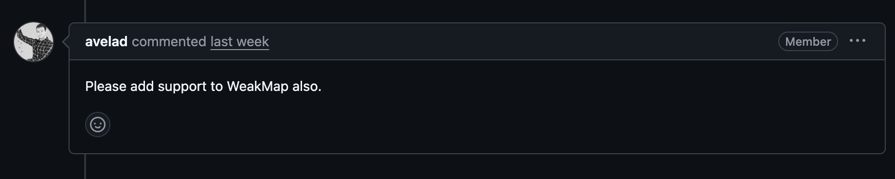
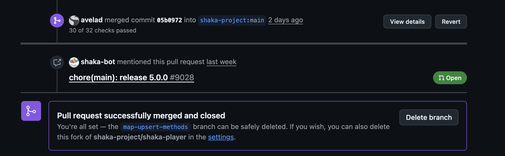

## 올해 두 번째 오픈소스 기여 🎉

지난번 [EME MediaKeySessionClosedReason 기능 구현](/shaka-player) 이후, Google Shaka Player에 두 번째 PR을 올렸습니다! 이번에는 **TC39 proposal-upsert**의 `getOrInsert` 및 `getOrInsertComputed` 메서드를 폴리필로 구현하고 프로젝트 전반에 적용하는 작업이었습니다.

## 어떠한 이슈였나요?

Shaka Player 레포지토리에서 [Issue #9502](https://github.com/shaka-project/shaka-player/issues/9502)를 발견했습니다. 메인테이너 [@avelad](https://github.com/avelad)님이 직접 올리신 이슈로, 내용은 다음과 같았습니다

> 최신 브라우저에서 TC39 proposal-upsert의 `getOrInsert` 메서드가 지원되기 시작했으니, 폴리필을 만들어 기존 코드를 리팩토링하자.

## TC39란 무엇인가?

아마 여러분들은 TC39 대신 ECMA Script라는 용어를 더 많이 들어보셨을 것 같습니다.

### TC39: JavaScript의 미래를 결정하는 위원회

**TC39(Technical Committee 39)** 는 ECMA International 산하의 기술 위원회로, ECMAScript 표준을 발전시키는 역할을 담당합니다. Google, Apple, Microsoft, Mozilla 등 주요 IT 기업의 전문가들이 참여하며, JavaScript에 추가될 새로운 기능들을 논의하고 결정합니다.

### 제안 단계 (Stage 0 ~ Stage 4)

TC39에서는 새로운 기능을 추가할 때 다음과 같은 단계를 거칩니다:

| Stage | 이름        | 설명                          |
| ----- | ----------- | ----------------------------- |
| 0     | Strawperson | 아이디어 제안 단계            |
| 1     | Proposal    | 문제 정의 및 해결책 제시      |
| 2     | Draft       | 초기 스펙 작성                |
| 3     | Candidate   | 스펙 완성, 브라우저 구현 시작 |
| 4     | Finished    | 표준에 포함 확정              |

[**proposal-upsert**](https://github.com/tc39/proposal-upsert)는 현재 **Stage 3**에 있으며, 이미 Safari 18.4, Chrome 145, Firefox 144 등 최신 브라우저에서 지원이 시작되었습니다!

## proposal-upsert의 getOrInsert

`Map`이나 `WeakMap`을 사용할 때 흔히 발생하는 문제가 있습니다. 바로 **키가 맵에 이미 존재하는지 확신할 수 없을 때 어떻게 업데이트를 처리할 것인가** 하는 문제죠.

보통은 먼저 키가 존재하는지 확인하고, 결과에 따라 삽입하거나 업데이트하는 방식으로 해결하는데... 솔직히 이게 좀 귀찮습니다. 그리고 한 번의 호출로 처리할 수 있는 작업을 굳이 여러 번 맵을 조회해야 하니까 성능적으로도 별로예요.

### 활용 예시 1: 데이터 그룹핑

데이터를 키별로 그룹핑하는 상황입니다:

```javascript
// 기존 방식
let grouped = new Map();

for (let [key, ...values] of data) {
  if (grouped.has(key)) {
    grouped.get(key).push(...values);
  } else {
    grouped.set(key, values);
  }
}

// getOrInsertComputed 사용
let grouped = new Map();

for (let [key, ...values] of data) {
  grouped.getOrInsertComputed(key, () => []).push(...values);
}
```

`Map.groupBy()`도 있지만, 이 메서드는 모든 데이터가 미리 준비되어 있어야 해요. `getOrInsert`를 사용하면 **점진적으로 데이터를 추가**할 수 있습니다.

### 활용 예시 2: 카운터 유지

특정 키의 등장 횟수를 세는 경우도 정말 많이 쓰이죠:

```javascript
// 기존 방식
let counts = new Map();

if (counts.has(key)) {
  counts.set(key, counts.get(key) + 1);
} else {
  counts.set(key, 1);
}

// getOrInsert 사용
let counts = new Map();
counts.set(key, counts.getOrInsert(key, 0) + 1);
```

### 활용 예시 3: 기본값 처리

사용자 설정에 기본값을 적용할 때도 깔끔해집니다:

```javascript
// 기존 방식
let prefs = getUserPrefsMap();

if (!prefs.has('useDarkmode')) {
  prefs.set('useDarkmode', true);
}

// getOrInsert 사용
let prefs = getUserPrefsMap();
prefs.getOrInsert('useDarkmode', true);
```

`getOrInsert`는 **기존 값을 덮어쓰지 않는다**는 게 포인트예요. 사용자 설정 → OS 설정 → 앱 기본값 순으로 적용해도 사용자가 직접 설정한 값은 유지됩니다.

### getOrInsert vs getOrInsertComputed

두 메서드의 차이는 간단해요:

- `getOrInsert(key, defaultValue)`: 기본값을 바로 넘김
- `getOrInsertComputed(key, callback)`: 기본값을 콜백 함수로 만듦

`getOrInsertComputed`는 기본값 계산이 무거울 때 유용합니다. 키가 이미 있으면 콜백이 실행되지 않거든요 (lazy evaluation).

### 다른 언어에서는?

사실 이 패턴은 다른 언어에서는 이미 지원하고 있었어요:

| 언어   | 메서드                             |
| ------ | ---------------------------------- |
| Python | `dict.setdefault()`, `defaultdict` |
| Java   | `computeIfAbsent()`                |
| Rust   | `entry().or_insert_with()`         |
| C#     | `ConcurrentDictionary.GetOrAdd()`  |

JavaScript도 드디어 이 대열에 합류하게 된 거죠!

### 브라우저 지원 현황

proposal-upsert는 **Stage 3**이고, 이미 최신 브라우저에서 지원을 시작했습니다:

- ✅ Safari 18.4
- ✅ Chrome 145
- ✅ Firefox 144

아직 지원하지 않는 브라우저를 위해 폴리필도 간단해요:

```javascript
// Map 폴리필
Map.prototype.getOrInsert = function (key, defaultValue) {
  if (!this.has(key)) {
    this.set(key, defaultValue);
  }
  return this.get(key);
};

Map.prototype.getOrInsertComputed = function (key, callbackFn) {
  if (!this.has(key)) {
    this.set(key, callbackFn(key));
  }
  return this.get(key);
};
```

WeakMap도 동일한 방식으로 폴리필을 적용할 수 있습니다.

## 오픈소스 해결 도중 여러한 난관들

### 🔥 난관 1: WeakMap 지원 요청

처음 PR을 올렸을 때 Map에 대한 폴리필만 구현했는데, 메인테이너분이 **WeakMap도 지원해달라**고 요청하셨습니다.


<div class="caption">"Please add support to WeakMap also." - @avelad</div>

WeakMap을 추가하니 예상치 못한 문제가 발생했습니다...

### 🔥 난관 2: 다양한 브라우저 CI 테스트 실패

WeakMap 폴리필을 추가하고 나서 **CI 테스트가 대량으로 실패**하기 시작했습니다. 😱

Shaka Player는 Chrome, Firefox, Safari, Edge 등 다양한 브라우저 환경에서 자동화된 테스트를 수행합니다. 특정 브라우저에서는 동작하지만 다른 브라우저에서 실패하는 케이스들이 속출했습니다.

```
❌ Chrome 120: PASSED
❌ Firefox 144: PASSED
❌ Safari 18: FAILED - TypeError: undefined is not a function
❌ Edge 120: PASSED
```

### 🔥 난관 3: segment_prefetch.js의 Side Effect

가장 어려웠던 문제는 `segment_prefetch.js` 파일에서 발생한 **Side Effect** 문제였습니다.

기존 코드에서 `getOrInsertComputed`로 변환했을 때, 콜백 함수 내부의 `this` 바인딩이나 외부 상태 변경 로직이 예상과 다르게 동작하는 케이스가 있었습니다.

결국 이 파일은 기존 패턴을 유지하는 것으로 **revert**해야 했습니다.

이후 여러 차례의 수정과 리뷰를 거쳐, 마침내 **머지**될 수 있었습니다! 🎉


<div class="caption">PR 머지 성공!</div>

## 🤖 AI와 함께하는 오픈소스 기여

이번 기여에서도 AI의 도움을 많이 받았는데요.

생각보다 코드 패턴을 검색할 때 은근 유용했습니다. 패키지에 파일이 정말 많다 보니 `has → set → get` 패턴을 사용하는 곳을 일일이 찾기가 쉽지 않았거든요. AI한테 "이 패턴 쓰는 곳 다 찾아줘"라고 하면 금방 찾아주니까 리팩토링할 위치를 빠르게 파악할 수 있었습니다.

물론 그러다 보니 난관 3처럼 Side Effect가 발생하는 문제도 있었어요. 무작정 다 바꾸다가 `segment_prefetch.js`에서 터진 거죠. 😅

그런데 이것도 결국 AI랑 같이 "왜 여기서 안 되는 거지?" 하면서 Side Effect가 발생할 수 있는 부분을 함께 분석해나갈 수 있어서 좋았습니다. 혼자 디버깅했으면 훨씬 오래 걸렸을 것 같아요.

최근에 AI를 적극적으로 활용하게 되면서, 순수하게 **페어 프로그래밍 동료**가 생긴 기분이에요. AI가 정답을 바로 알려주기보다는, 복잡한 코드베이스를 함께 탐색하고 문제 해결 방향을 논의해주거든요.

앞으로도 이렇게 저만의 동료와 함께 오픈소스에 지속적으로 기여해볼 계획입니다! 🚀

---

## 관련 링크

- [PR #9546: perf: Use Map.getOrInsert/getOrInsertComputed native methods](https://github.com/shaka-project/shaka-player/pull/9546)
- [Issue #9502: Prefer Map's getOrInsert and getOrInsertComputed methods](https://github.com/shaka-project/shaka-player/issues/9502)
- [TC39 proposal-upsert](https://github.com/tc39/proposal-upsert)
- [ECMAScript proposal spec](https://tc39.es/proposal-upsert/)
